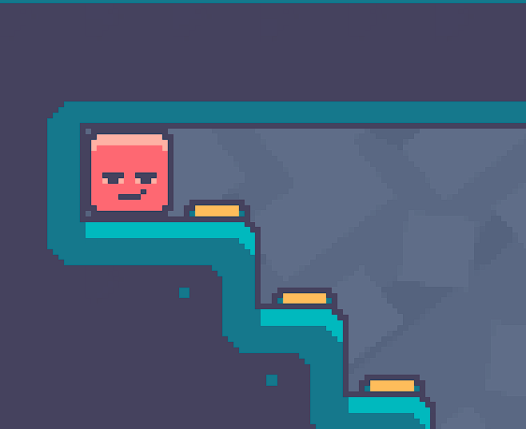

# LinkSider

**The game is now being continued in a private repository**

**You can [wishlist the upcoming release on Steam](https://store.steampowered.com/app/2995150/Linksider/)**

## In this repo

Game made for Bevy Jam 3 🦀 in 9 days

Some refactorings have happened since the jam, you may see the jam version on the [jam-version branch](https://github.com/kuviman/linksider/tree/jam-version).

[🎮 PLAY THE GAME ON ITCH.IO](https://kuviman.itch.io/linksider)

In this puzzle game you can attach different effects to player's sides and use them to complete the level

Controls:

- `A` / `D` or `Left` / `Right` - move the player
- `Up` / `Down` - change the player (on levels with multiple players)
- `R` / `Backspace` - restart the level

Made by:

- ⌨️ Programming - kuviman
- 🎚️ Level Design - Daivy
- 🖼️ Art - Daivy
- 🎉 Visual effects - kuviman, SHADOW_CRUSHERZ
- 🎵 Music - Brainoid, SHADOW_CRUSHERZ
- 🔈 Sound effects - Kuviman
