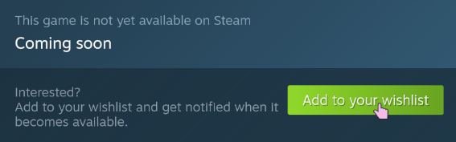

---
---

# Linksider is coming to Steam

<!-- {{ hero_img(src="../logo.png") }} -->

Hello!

Linksider is a puzzle game that was originally made for [Bevy Jam 3](https://itch.io/jam/bevy-jam-3/results) (and took #1).
After spending more than a year porting, rewriting,
and iterating over the initial gamejam version,
Linksider is coming to Steam!

[**You can wishlist it now**](https://store.steampowered.com/app/2995150/Linksider/)

{{ youtube(id="z5RePgXW5yM") }}
{{ img_text(text="Linksider trailer") }}

## Jam version

{{ hero_img(src="bevyjamresults.png") }}
{{ img_text(text="bevy jam results") }}

If you didn't play the jam version, you can do so on [itch.io](https://kuviman.itch.io/linksider).

A lot of changes happened since then, which I describe shortly in this blog post.

## Custom game engine

The game was initially written in [The Bevy Engine](https://bevyengine.org/).
However, shortly after the jam we made the decision to rewrite it from scratch,
using a [custom game engine](https://geng.kuviman.com/) (still in Rust 🦀).
It was probably the lack of experience with ECS
(Entity Component System) frameworks
made it challenging to maintain the Bevy-based code.
Post-rewrite, managing the codebase became significantly easier.

## In-game level editor

Another thing that we quickly decided to write ourselves instead of using existing tool was the level editor.
During the jam we were using [LDTK](https://ldtk.io/),
but having a dedicated level editor allowed us to have features not possible otherwise, for example, attaching side effects to different sides of entities.

{{ hero_img(src="editor.gif") }}
{{ img_text(text="in-game level editor") }}

## Reworked game mechanics

Now, to the actually new features of the game.

Pretty much every single game mechanic was reimagined to make the game more intuitive.

{{ hero_img(src = "oldnewjump.gif") }}
{{ img_text(text="Old jump vs new jump") }}

And, of course we also introduced a bunch of new things.

The biggest change to the game logic is that it is no longer a turn based game,
since multiple entities can now potentially move at the same time.
Also, different moves can now take different amount of time.
This allows us to have, for example, acceleration when falling,
making the game feel like it actually has physics,
although we are still working on an integer grid.

{{ hero_img(src = "portalmomentum.gif") }}
{{ img_text(text="Momentum when jumping through portal") }}

## Undo/redo

Since the game is no longer turn based,
implementing an undo functionality
(which we didnt have in the jam version)
was non trivial.

So, the way we store history is by having snapshots of the game states
at important moments - when a move starts, or when a move ends.
The game state itself contains information about all the currently happening moves,
which we can interpolate in order to render the game.

{{ hero_img(src = "undoredo.gif") }}
{{ img_text(text="Undo/redo") }}

<!-- ## Level selection

The jam version worked by putting you in the game directly,
and you solved puzzles one by one,
without the ability to go back or skip levels.

In the new version of the game we now have proper level selection.
This was one of the hardest things for us,
we went through multiple completely different designs for it. -->

## So release when?

We are working towards figuring out when the game will actually be released, but its not ready yet.

Hopefully we can get it released this year.

Our first priority is a Steam release,
but the game is also already working on Android,
and eventually we plan to figure out how to build for iOS, too.

[WISHLIST THE GAME NOW](https://store.steampowered.com/app/2995150/Linksider/)
to get notified about the release when it happens. ❤️

